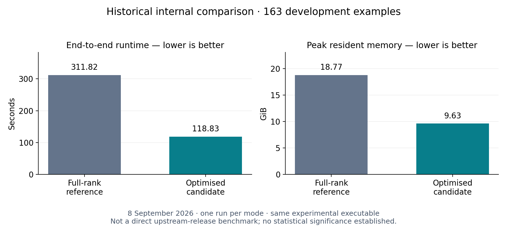

# Recorded performance and numerical trade-offs

These results demonstrate a substantial observed runtime/memory improvement for
specific internal comparisons. They do **not** establish statistical significance
or a controlled comparison against a separately built original upstream release.
All tables contain one run per mode. No error bars or scaling curves are inferred.

## Historical 163-example comparison

Measured on 8 September 2026 using two paths in the same historical experimental
executable, on the same host and input, with GOMAXPROCS=4, GOGC=50, LogN=14,
LogQP=437, default scale 2^33 and the same rotation-key set. These are recorded
historical settings, not a new security certification. Both modes enabled memory
management and profiling. The approximate candidate used score ranks
`10,10,8,10`, value ranks `24,24,24,24` and adaptive fixed-point arithmetic.

| Metric | Full-rank reference | Optimised candidate | Observed change |
|---|---:|---:|---:|
| Total runtime | 311.82 s | 118.83 s | **2.62× speedup; 61.89% less time** |
| Peak RSS | 18.771 GiB | 9.625 GiB | **48.72% lower** |
| Classification accuracy | 60.123% | 60.736% | +1 correct example out of 163 |
| Micro-AUC | 0.928174 | 0.928118 | −0.000056 |
| CKKS numerical RMSE | 18.658 | 21.242 | Higher numerical error |
| Total RMSE vs unapproximated plaintext model | 18.658 | 21.840 | Higher total error |



The baseline is the experimental executable's full-rank reference path. It is
not a pristine checkout of `hangenba/enc_dashformer`. The 163 examples were used
for development; they are not an independent final or official competition test
set. The small accuracy/AUC changes are observations, not evidence of improved
predictive quality or equivalence. Numerical RMSE compares each encrypted result
with its corresponding plaintext computation; total RMSE also includes model
approximation. These errors therefore measure different quantities.

The timing and aggregate metric source files are published under
[`benchmarks/recorded/`](../benchmarks/recorded/). Linux time's maximum-RSS values
are converted from KiB to GiB by dividing by 1,048,576. Binary/input hashes in the
summary originate from the historical experiment record; the plotting script
independently verifies the copied measurement-file hashes. The old executable
has not been rebuilt or rerun for this documentation update.

## Release functional check: one example

Measured on 23 September 2026, using `--baseline` and
`--value-basis --hoisted-rotations` in the same release executable. Both used
`--log-p 31,31` (LogQP approximately 430), the same model and one input example,
and independently generated keys. This is a separate experiment from the table
above, with different configuration and input size.

| Metric | Full-rank reference | Optimised path |
|---|---:|---:|
| Total runtime | 313.853 s | 108.012 s |
| Observed runtime ratio | 1.00× | **2.91× faster** |
| Successful completion | Yes | Yes |

The one top prediction agreed, but maximum raw-score difference was **395.27145**
and pairwise score RMSE was **131.34689**, after legacy output scaling. This does
not establish accuracy preservation. Peak RSS and ground-truth accuracy were
not measured by this smoke runner. The pairwise RMSE here must not be equated
with the CKKS-only numerical RMSE in the historical table.

## Data and regeneration

The [machine-readable summary](../benchmarks/recorded/comparison.json) contains
exact available measurements, experiment identities, sample counts, configuration,
hashes and limitations. Only aggregate measurements and timing records are
published, not sequences, model weights, labels or per-example predictions.

Regenerate the PNG/SVG bar charts with Python and matplotlib installed:

```bash
python3 scripts/plot_benchmarks.py
```

Run new paired measurements on assets you may use:

```bash
./reproduce.sh build
python3 scripts/benchmark.py --data-dir /path/to/assets \
  --examples /path/to/sequences.list --output-dir results/new-comparison --repeats 3
python3 scripts/compare_outputs.py results/new-comparison/01-baseline/output.txt \
  results/new-comparison/01-optimized/output.txt
```

This runner still compares internal paths. To establish the stronger claim
“better than the original enc_dashformer,” separately pin and build the upstream
commit, match input/model data, cryptographic settings, hardware and thread
limits, and run repeated interleaved measurements. Report runtime variability,
peak memory and labelled accuracy together. Do not substitute the historical
measurements above for that missing experiment.
